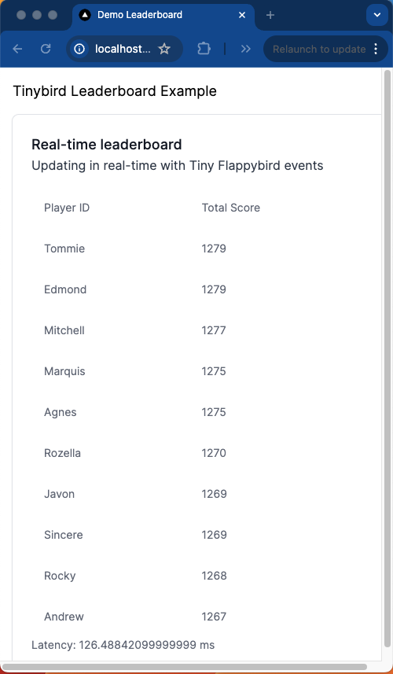

# Building a user-facing leaderboard

This leaderboard demo's use of JSON Web Tokens (JWTs) is based on [this guide](https://github.com/tinybirdco/guide-nextjs-jwt-auth).

That repo contains a minimal example demonstrating:
1. Generating self-signed JWTs for Tinybird
2. Consuming Tinybird API Endpoints in a Next.js frontend app using a self-signed JWT

You can read more about JWTs in Tinybird in the [documentation](https://www.tinybird.co/docs/concepts/auth-tokens#json-web-tokens-jwts), and there is a full [end-to-end guide](https://www.tinybird.co/docs/guides/integrate/consume-apis-nextjs) covering this example.

## Run the example locally

### Prerequisites

- Node.js >= v18
- A [free Tinybird account](https://tinybird.co)

### Setup

1. Clone this repo.
2. Create a new Tinybird Workspace.
3. Deploy the `/datasources` and `/pipes` [Tinybird resources](/tinybird) to the Tinybird Workspace (drag and drop the files in the Tinybird UI), thereby creating 2 x Data Sources and 3 x Pipes.

### Install dependencies

Install app dependencies. From the root of the repo:

```bash
npm install
```

### Add your Tinybird parameters

First create a new file `.env.local`

```bash
touch .env.local
```

You need to copy your Tinybird host and token to the `.env.local` file in your directory:

```bash
TINYBIRD_SIGNING_TOKEN="YOUR SIGNING TOKEN" # Use your Admin Token as the signing token
TINYBIRD_WORKSPACE="YOUR WORKSPACE ID" # The UUID of your Workspace
NEXT_PUBLIC_TINYBIRD_HOST="YOUR API HOST. E.G. https://api.tinybird.co" # Your regional API host
```

### Run the demo app

Run it locally:

```bash
npm run dev
```

Then open [http://localhost:3000](http://localhost:3000) with your browser. Your leaderboard won't have any data in it yet, so [read the tutorial]() to learn how to generate real-time data and populate it:


